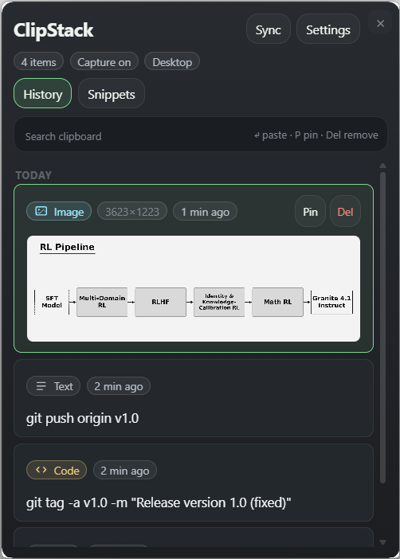
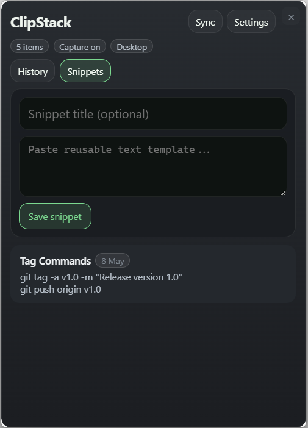
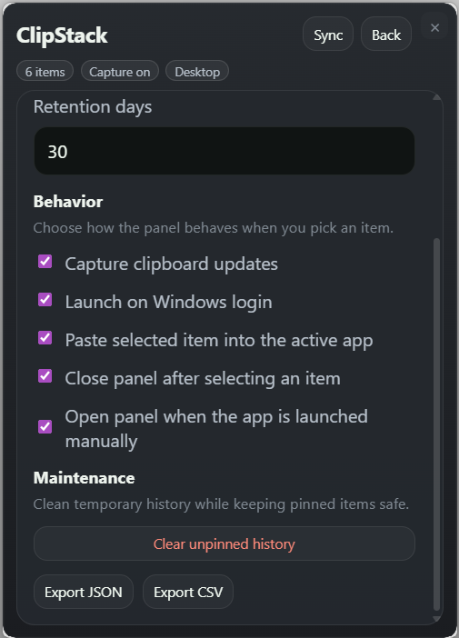
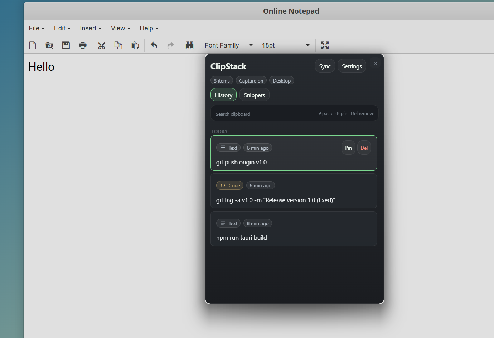

# ClipStack

ClipStack is a fast, local-first clipboard manager for Windows built with Tauri + React.
It gives you searchable clipboard history, pinning, cleanup controls, and quick paste workflows from a lightweight overlay UI.

## Screenshots

### History



### Snippets



### Settings



### In use



## Features

- Global shortcut overlay (`Alt` + `V`)
- Clipboard history for text and images with local SQLite storage
- Fuzzy search with grouping (Pinned, Today, Earlier) and duplicate counts
- Content type chips with inline previews (URLs, email, file paths, code, images)
- Pin/unpin, delete, clear unpinned, and export history (JSON/CSV)
- Snippets panel for reusable text
- Tray controls for show/hide, pause capture, and quit
- Overlay remembers position and stays always on top
- Optional launch on Windows login and paste-on-select

## Tech Stack

- Tauri 2 (Rust backend + desktop shell)
- React 19 + TypeScript + Vite
- SQLite via `rusqlite`

## Project Structure

- `src/` - React frontend (overlay UI, keyboard navigation, settings panel)
- `src-tauri/src/` - Rust backend (clipboard monitor, storage, commands, tray/window behavior)
- `src-tauri/tauri.conf.json` - Tauri app/window/bundle configuration

## Prerequisites

- Node.js 18+ (recommended: latest LTS)
- Rust stable toolchain
- Windows 10/11
- Microsoft WebView2 runtime

## Development

Install dependencies:

```bash
npm install
```

Run the desktop app in development:

```bash
npm run tauri dev
```

## Build

Build frontend only:

```bash
npm run build
```

Build desktop installer/executable:

```bash
npm run tauri build
```

Generated installer output (default):

- `src-tauri/target/release/bundle/nsis/ClipStack_<version>_x64-setup.exe`

## Keyboard Shortcuts

- `Alt + V` - Toggle ClipStack overlay
- `Arrow Up / Arrow Down` - Navigate items
- `Enter` - Select item (copy/paste behavior follows settings)
- `Delete` - Delete selected item (when search box is empty)
- `P` - Pin/unpin selected item
- `Ctrl + Shift + P` - Alternate pin/unpin shortcut
- `?` - Toggle shortcut hint bar
- `Esc` - Close overlay

## Settings

Current in-app settings include:

- History limit
- Retention period (days)
- Clipboard capture on/off
- Launch on login
- Paste selected item into active app
- Close panel after selecting an item
- Open panel when app is launched manually
- Clear unpinned history
- Export history (JSON/CSV)

## Privacy

ClipStack is local-first:

- Clipboard history is stored on-device in app data (`clipstack.db`)
- No cloud sync or external clipboard upload by default

## Roadmap

- Rich content support (images/files)
- Better filtering and tags
- Export/import history
- Additional customization and shortcuts

## Website

The static project site lives in `docs/` and is deployed to GitHub Pages via `.github/workflows/pages.yml` when changes are pushed to the `docs/` folder.

## Releases

Windows NSIS installers are built by GitHub Actions on `v*` tags. Release notes are generated from git history with sections for features, fixes, and performance updates.

## License

This project is licensed under the MIT License. See [LICENSE](./LICENSE).
